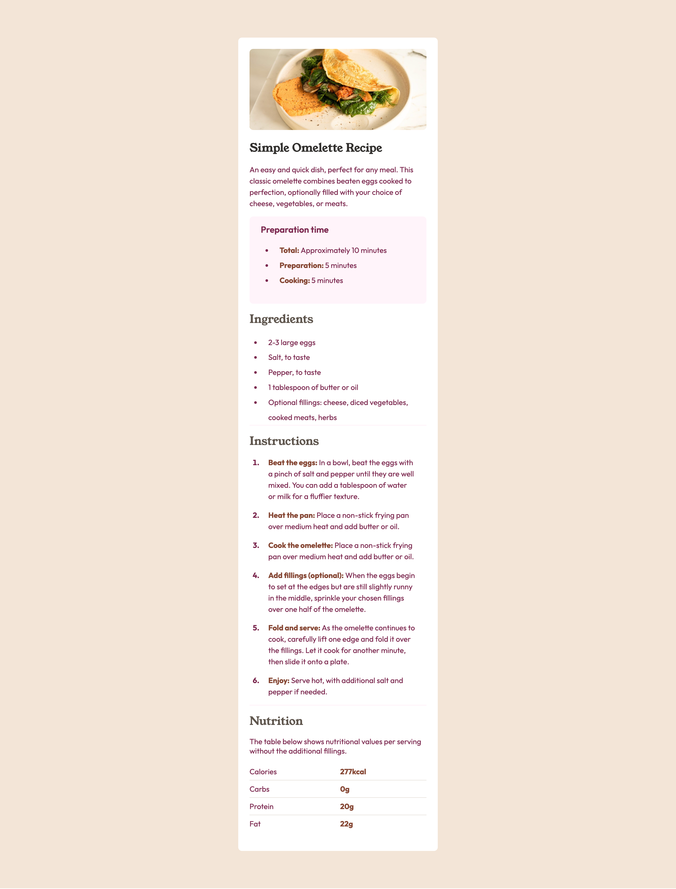

# Frontend Mentor - Recipe page solution

This is a solution to the [Recipe page challenge on Frontend Mentor](https://www.frontendmentor.io/challenges/recipe-page-KiTsR8QQKm). Frontend Mentor challenges help you improve your coding skills by building realistic projects. 

## Table of contents

- [Overview](#overview)
  - [The challenge](#the-challenge)
  - [Screenshot](#screenshot)
  - [Links](#links)
- [My process](#my-process)
  - [Built with](#built-with)
  - [What I learned](#what-i-learned)
  - [Continued development](#continued-development)
- [Author](#author)
- [Acknowledgments](#acknowledgments)

## Overview

### The challenge

The challenge is to build out this recipe page and get it looking as close to the given design as possible.

### Screenshot



### Links

- Solution URL: [Add solution URL here](https://github.com/rishav-sah/recipe-page-ui)
- Live Site URL: [Add live site URL here](https://rishav-sah.github.io/recipe-page-ui/)

## My process

### Built with

- Semantic HTML5 markup
- CSS custom properties
- Mobile-first workflow

### What I learned

I undertook this challenge mainly to re-engage with coding after a gap of a couple of months. While this task is relatively beginner-friendly, I firmly believe that revisiting fundamental concepts is essential, especially when diving back into more advanced topics.

One noteworthy learning from the CSS portion is the :not(:last-child) selector, which targets elements that are not the last child within their parent element. Additionally, I recommend fellow developers to cultivate a strong understanding of CSS specificity.

```css
.nutrition-table tr:not(:last-child) th,
.nutrition-table tr:not(:last-child) td {
  border-bottom: 1px solid var(--light-grey); 
}
```

### Continued development

In the future, I plan to focus on dynamic projects using plain HTML, CSS, and Vanilla JavaScript to reinforce my understanding of the basics. I also aim to undertake larger-scale projects involving frameworks and libraries.

## Author

- LinkedIn - [Rishav Sah](https://www.linkedin.com/in/rishav-sah-b1966b190/)
- Frontend Mentor - [@rishav-sah](https://www.frontendmentor.io/profile/rishav-sah)
- Twitter - [@nerd\_\_rishav](https://twitter.com/nerd_rishav)

## Acknowledgments

Frontend Mentor is an excellent platform for front-end developers seeking to challenge themselves by building user interfaces from scratch, encompassing requirements gathering, customization, and more. The platform offers modern and practical web designs based on real-life use cases.
